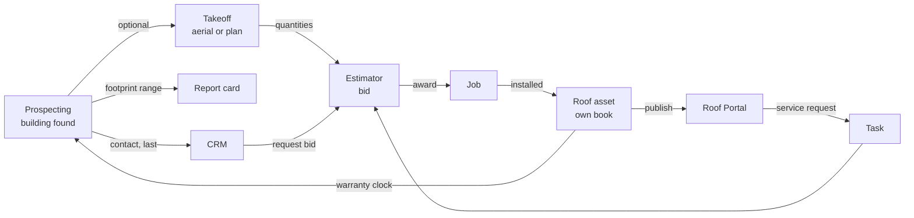

# Roofing Ops Portal — Handoff Brief

Sep 20, 2026 · revised Sep 23, 2026 from inside the estimator repo (`roof-estimator-shell`).
This revision replaces the earlier draft. It orders the work the way the owner wants it
(Prospecting first, then Takeoff, CRM last), describes what already exists so no module
re-invents it, and states the rules that keep the bid software stable while the rest grows.

## Purpose and principles

One portal for the roofing company. The bid tool (Bid-O-Matic, the Duro-Last estimator that
replaced Bid-Advantage) is live and at parity with the legacy program. Around it, in this
order: prospecting (territory roof database, condition scores, triggers, report cards), plan
and aerial takeoff (replacing PlanSwift), a customer roof portal, and last a CRM. Each module
works on its own; the flows between them are shortcuts, never requirements.

Rules every agent follows:

- **The estimator is finished-shape.** Its money engine matches Bid-Advantage line by line
  (`docs/legacy-money-parity.md`, 22 sections, IL-verified). New modules attach to bids
  through nullable link columns and read bid data; they never change how a bid is priced. Any
  engine change, from any module, still goes through the parity docs with a test.
- **Standalone first.** An estimator prices a job with no building, takeoff, or CRM record
  behind it. Prospecting scores a roof with no bid. Takeoff works on a bare PDF.
- **Flow is a button, not a gate.** Every record offers "Create from this" links into the next
  module, and every link is optional and reversible.
- **One shared schema, independent modules.** All modules read and write the same Supabase
  project, but no module's code imports another module's code. A broken prospecting job never
  blocks a bid going out.
- **Manufacturer-agnostic core.** Buildings, roofs, takeoffs, contacts, and pipeline carry no
  Duro-Last assumptions. Duro-Last lives in the estimator's pricing catalog only.
- **Measured, not assumed.** Any scoring or automation ships with a held-out test and a
  pre-registered metric before it drives outreach. Same rule the estimator followed: nothing
  is claimed without proof.

## What exists today (Bid-O-Matic)

Everything below is built, deployed through Lovable, and in daily use. The other modules
extend this; they do not rebuild it.

| Area | What it does | Where |
| --- | --- | --- |
| **Estimator** | Ten legacy-parity steps: Setup, Sections, Underlayment (5 layers, quotes, adhesives, enhancement options), Parapets, Curbs, Accessories (21 calculated screens), Metals, Tear-Off, Non-DL (six tile screens), Review (the legacy Estimate Review ledger). Save button in the step row, unsaved-changes marker, per-step labor links and pop-ups, complexity and sheet-size factors, labor templates, hours per man-day, per-diem chart under Setup notes | `/estimate`, `src/lib/engine/*` |
| **Roof systems** | Duro-Last, Duro-Bond, Duro-Tuff, Duro-Fleece, Duro-Roof, plus web-only Duro-Tech TPO and non-DL TPO / EPDM | engine + Estimate Pricing |
| **Bids** | List with status, "Last saved … by", search, delete with restore, bid locks (one editor at a time), **Bid Combiner** (tick several bids → one merged bid, the legacy BidCombiner rules) | `/bids` |
| **Frozen pricing per bid** | Every bid carries its own snapshot of prices, labor tables, and templates (as the legacy .bax did). The black **Update pricing & labor** button re-applies current catalog data on demand; an amber dot marks a bid whose snapshot is older than the catalog | `/estimate` |
| **Proposal / export** | Printable proposal and export from the Review step | `/proposal` |
| **Estimate Pricing** (the old "Admin" branch, renamed) | General (contractor, shipping, sales tax, basic labor, markup options, warranties), Advanced Labor (setup, inspection, templates, roof deck, curb, parapet, accessory), Duro-Last Pricing (membrane, underlayment, fasteners, sealants, adhesives, 15 accessory catalogs), Non-DL Pricing, Underlayment / Tearoff Times | `/admin/*` |
| **Price List Import** | Upload the Duro-Last Excel price list; review every change (price, new product, item number) and confirm; import runs are logged | `/admin/price-import` |
| **Item numbers** | Duro-Last item numbers on catalog rows, taken only from the price workbook | `catalog_item_numbers` |
| **Inventory** | Record stock by item number or product (pieces or packs, true units: tube, bag, cartridge, roll), on-hand by product, a movements ledger with reasons (received, adjusted, consumed on bid, released), settings. On a bid's Review step an **Order list** shows every product the bid needs, what is on hand, "Use from inventory" / "Put back" per line, and **To buy** = needed − what this bid actually pulled. Print/PDF and Excel export. Stock never changes bid price | `/inventory`, Review step |
| **Users & access** | Admin assigns per-page access flags (Estimate, Estimate Pricing, Inventory) in any combination; RLS enforces the same flags on every table and server function | `/admin/users`, `profiles.role`, `profiles.access[]` |
| **Sign-in** | Supabase Auth, email + password, accounts created by an admin; the gate never spins forever (timeout, Reload, Sign in again); an Unauthorized reply drops the session and returns to login | `/login` |

Tech: TanStack Start + React + Tailwind + shadcn, Supabase (41 public tables, RLS on all),
server functions behind a Supabase-token middleware, Lovable builds and publishes from `main`,
Nitro/Cloudflare worker output, 33 test files / 449 tests, typecheck and lint clean. The
legacy install files (IL toolkit) and the parity docs are the reference for any estimator
question; the vendor database is off limits.

## Modules

Six modules, in build order. "Alone" is what it must do with nothing else in the database;
"Flows" are the optional handoffs it offers.

| # | Module | Alone | Flows out | Flows in |
| --- | --- | --- | --- | --- |
| — | **Estimator** (built) | Price a Duro-Last or non-DL job from typed quantities; catalogs; proposal | Bid → Job on award (a bid status today; a `jobs` row later); bid value → CRM opportunity (last) | Takeoff quantities prefill inputs; Building prefills address, size, roof type |
| — | **Inventory** (built) | Stock by item number, movements ledger, order list per bid | Order list → purchase list (print / Excel today; supplier order later) | Bids pull from stock; received stock from deliveries |
| 1 | **Prospecting** | Territory roof database on a map; owner of record; roof clips; condition scores; nightly triggers (storms, sales, permits, bid boards); tasks-lite; report-card PDFs; mail queue | Building → Estimator (prefill); Building → aerial takeoff (once Takeoff exists); Building → CRM contact/opportunity (last) | Won / installed bids return as "own book" roofs with warranty dates |
| 2 | **Takeoff** | Open a PDF plan sheet, calibrate scale from one known dimension, draw areas / lines / counts, export quantities | Takeoff → Estimator (quantities map to estimator inputs, live) | Building → aerial takeoff on KyFromAbove imagery, scale already known |
| 3 | **Roof Portal** (customer-facing) | A customer logs in to see their roofs, warranties, inspection photos, repair history, and request service | Service request → task (Prospecting tasks-lite until CRM exists) → Estimator | Installed bids and inspections publish here |
| 4 | **CRM** (last) | Contacts, companies, opportunities, activities, tasks, lead source; Bids and Service pipelines; follow-up sequences; maintenance agreements; job costing; win/loss | Opportunity → Estimator; won → Job | Any module creates an activity or opportunity against a building or contact; Prospecting tasks-lite migrates into CRM tasks |

Takeoff is still the hinge for the automated path, but Prospecting does not wait for it:
a **budgetary range from the footprint** (building sqft × $/sq ft bands taken from past
bids by roof type and size) gives report cards a number before any drawing exists. Takeoff
later replaces that range with a measured one.

Two things the earlier draft assumed that are not true here:

- There is no separate `estimates` table; bids live in `bids` (jsonb `data` plus the frozen
  admin snapshot). Link columns go on `bids`.
- Roles are not five flags on a hierarchy; they are `profiles.role` (admin / user) plus a
  per-page `access` list. New modules add pages to that list (`prospect`, `takeoff`,
  `portal`, `crm`). Admin already manages users on its own page.

## Shared data spine

Added per phase, not all at once, so tables are designed when their screens are. Every
foreign key is nullable; that is what keeps each module standalone. Geometry as PostGIS
(enable the extension in the Prospecting migration). Scores and quantities are JSON with a
`version` field.

| Table | Phase | Owner | Key fields | Links (all optional) |
| --- | --- | --- | --- | --- |
| `bids` (exists) | 0 | Estimator | as today; add nullable `building_id`, `roof_id`, `takeoff_id`, `opportunity_id` | — |
| `buildings` | 1 | Prospecting | parcel_id, county, address, owner of record, footprint (geometry), sqft, year built, land use, imagery clips, condition_score, score_version, own_book | company_id (later) |
| `roofs` | 1 | Prospecting | building_id, section name, roof type, area, install date, installer, warranty type and expiry, last inspection | building_id, bid_id (if we installed it) |
| `tasks` (tasks-lite) | 1 | Prospecting | title, due, assignee, status, source | building_id, trigger_id; adopted by CRM later |
| `triggers` | 2 | Prospecting | building_id, kind (storm, sale, permit, bid board, warranty expiry, school plan), source, event date, payload, status | building_id, task_id |
| `report_cards` | 2 | Prospecting | building_id, PDF ref, imagery vintage, budgetary range, mailed_at, mail provider id | building_id |
| `takeoffs` | 3 | Takeoff | underlay type (pdf or aerial), file ref, scale calibration, objects (geometry + type), computed quantities (JSON, versioned) | building_id, roof_id, bid_id |
| `jobs` | 3 | Estimator | bid_id, status, start/complete dates, warranty registered | bid_id, roof_id |
| `companies`, `contacts` | 5 | Roof Portal / CRM | name, type, address; name, role, phone, email, company_id, source | company_id |
| `service_tickets` | 5 | Roof Portal / CRM | kind, reported_by, photos, priority, SLA due, status, quote amount, source | building_id, roof_id, contact_id, bid_id, job_id |
| `opportunities`, `activities`, `follow_up_sequences`, `maintenance_agreements`, `job_costs`, `bid_outcomes` | 6 | CRM | as in the earlier draft | building_id, contact_id, bid_id, job_id |

Conventions carried over from the estimator: `created_by` and `updated_at` on every table
(with the `update_updated_at_column` trigger), RLS by page flag, a migration file in
`supabase/migrations/` for every live change, applied then verified.

## Cross-module flows

How a handoff is built, the same way every time:

1. The source record shows a **Create → [next module]** action.
2. The action creates the target record with the source's id in the nullable link column and
   prefills whatever maps cleanly (address, sqft, roof type, quantities, contact).
3. The target opens in its own module; from there it is an ordinary record. The link shows as a
   chip back to the source and can be cleared.
4. Nothing is written back to the source except the link. Bids never edit buildings; takeoffs
   never edit bids after creation. If a takeoff changes, the estimator shows "quantities updated,
   apply?" rather than overwriting, the same way Update pricing & labor works today.

Own-book seeding does not need a job history import to start: every bid in the database with
a won / installed status becomes a `roofs` row with its sections, system, and install date.
Older jobs come from the .bax importer (below) or a spreadsheet.

## Runtime architecture

One React app, one Supabase project, one background worker. Nothing else until something
forces it.

| Layer | Choice | Why |
| --- | --- | --- |
| Web app | This repo, one route group per module: today `/bids`, `/estimate`, `/proposal`, `/inventory`, `/admin/*`; new `/prospect`, `/takeoff`, `/portal`, `/crm` | One login, one deploy; routes load lazily, so map and PDF libraries only download on their pages |
| Database | The existing Supabase project, PostGIS enabled in phase 1 | Shared spine; RLS and page flags already in place |
| Storage | Supabase Storage buckets: `plans`, `imagery`, `reports`, `photos` | Signed URLs; portal customers only see their own |
| Worker | A separate repo: a small Python service on Railway or Fly, on cron, writing to Supabase with a service key | Imagery clipping, scoring, PDF parsing, and nightly ingestion exceed edge-function limits and share nothing with the web build |
| Takeoff canvas | pdf.js to render sheets, Konva for drawing on plans, MapLibre for drawing on aerial tiles | Same object model on both underlays |
| Map | MapLibre with KyFromAbove as a tile source | Free, 3-inch, statewide |
| Scoring | Claude vision via the Anthropic API for tier 1; a fine-tuned classifier on the worker for tier 2 | Both write `condition_score` + `score_version` |
| Mail | Lob API for report cards | Automates the one physical step |
| Telephony | Out of scope for now | — |

Access: `profiles.role` stays admin / user; `profiles.access` gains `prospect`, `takeoff`,
`portal` (customer accounts get only this one), and `crm`. Admin assigns any combination.

### Keeping the estimator stable while the portal grows

- **Branch per module, pull request into `main`, CI gate** (typecheck, lint, tests) before
  anything reaches Lovable. Today the estimator pushes to `main` directly; that stops once a
  second module exists, because one broken commit takes every module down.
- **Feature flag per module** until it is usable, so a half-built page never shows in the nav.
- **Folder boundaries**: `src/modules/<name>/` for each new module, with a lint rule that
  forbids cross-module imports. The engine (`src/lib/engine/`) and the estimate route stay
  owned by the estimator session; other sessions do not edit them.
- **Bids are read-only to other modules** except the link columns.
- **No history rewrites on `main`** (Lovable sync rule already in `AGENTS.md`).
- A `MODULES.md` naming folders, owners, and flags is the first file written.

## Build order

Each phase is usable on its own the day it ships. Exit criteria are what Braden checks before
the next phase starts. The estimator runs a maintenance track alongside (its own backlog is
listed after the table).

| Phase | Scope | Exit criteria |
| --- | --- | --- |
| 0 — Guardrails + link columns | CI workflow, branch/PR rule, module folders and lint rule, `MODULES.md`, feature flags; migration adding nullable link columns to `bids`; PostGIS on | CI blocks a failing commit; estimator rebuilds two saved bids to the same numbers |
| 1 — Prospecting A: buildings | Parcel ingest for the core counties (PVA / Regrid fallback), Microsoft footprints where PVA has none, KyFromAbove clips per building, map view with search and filters, building page, own-book import from won bids, tasks-lite | Every commercial parcel in the core counties has a building row with a footprint and a clip; sales can open a building and see what we know |
| 2 — Prospecting B: scores, triggers, report cards | Tier-1 Claude scoring on all clips with 100 hand-labeled roofs held out; nightly SPC, HailTrace, Shovels, and PVA-transfer ingestion into `triggers` → tasks; footprint-based budgetary range; report-card PDF → Lob → task "call in 7 days" | Scoring precision on the held-out set reported and accepted; triggers create tasks with no manual step; first batch of 50 report cards mailed with response tracked |
| 3 — Takeoff on plans | PDF upload, one-point scale, area / line / count tools, quantity export, object → estimator input mapping, live bid update; `jobs` table | An estimator measures a real plan set and produces a bid without opening PlanSwift |
| 4 — Aerial takeoff | The phase-3 tools on KyFromAbove tiles with scale already known; auto-takeoff from the footprint replaces the budgetary range in report cards | A report card carries a measured number with no human drawing |
| 5 — Roof Portal | Customer accounts (`portal` flag), companies and contacts, roofs, warranties, inspection photos, service requests → tickets → tasks | One customer account live with real data |
| 6 — CRM | Opportunities, activities, Bids and Service pipelines, follow-up sequences, maintenance agreements, job costing (estimated-vs-actual by the ledger's labor categories), win/loss capture and reporting; tasks-lite folds in | Sales logs a full week in the CRM with nothing in the old system |
| 7 — Tier-2 model, plan AI | Fine-tuned classifier; vintage diffs; AI roof detection on plans | Classifier beats tier 1 on the same held-out set |

Phase 3 can start while phase 2 is in flight; they share only the spine. Phase 4 waits on
phase 3 because it reuses the canvas.

**Estimator maintenance track** (owner's open list, in no fixed order): .bax importer (the
file is a zip holding one XML document with the bid, its frozen pricing copy, and reports;
mapping into the tile screens is the work), an admin "order pack" size per product for the
order list, the opened-box rule for partial packs, induction-welding attachment for TPO, the
fire-rated adhered-layer check against a legacy Summit figure, tear-off rates for Metal
Retrofit / Purlin Fastened decks (legacy seeds them at 0), and a "Remove all extra lines"
button on the older-bid catalog cards.

**Takeoff design note.** The engine, like Bid-Advantage, prices a section as a rectangle with
per-side edges (perimeter enhancement zones come from the marked sides). A takeoff polygon
yields area and perimeter, not width × length. Before phase 3 starts, add an "area +
perimeter" section mode to the engine, with a parity test, so measured shapes price the same
way typed rectangles do. That is the one engine change the portal needs, and it goes through
the parity docs like any other.

## Data sources and integrations

Status as given in the Sep 20 draft (vendor pages), not re-verified here. Free-and-programmatic
sources carry the pipeline; paid ones are added per phase; "manual" sources are read by a person
or parsed by Claude on a schedule. Telephony is dropped.

| Source | Used for | Access | Cost | Phase |
| --- | --- | --- | --- | --- |
| KyFromAbove imagery | Roof clips, aerial takeoff underlay, vintages 2012–13 / 2019–22 / 2022–24 | ArcGIS Image Service, no login | Free | 1 |
| County PVA parcels | Owner of record, footprint, sqft, land use, transfers | ArcGIS MapServer query for published counties; Regrid API for the rest | Free / paid fallback | 1 |
| Microsoft building footprints | Roof polygons where PVA has none | Bulk download | Free | 1 |
| NOAA SPC storm reports | Hail / wind triggers | Daily CSV | Free | 2 |
| HailTrace | Verified hail swaths as polygons | API key | Paid | 2 |
| Shovels | Permit triggers (rooftop HVAC, re-roofs by competitors) | REST API | Paid | 2 |
| SAM.gov | Federal bid triggers | Public API | Free | 2 |
| OpenCorporates | LLC unmasking | API | Free tier / paid | 2 |
| Anthropic API | Tier-1 scoring, PDF parsing of facility plans | API | Per call | 2 |
| KDE district facility plans | School roof projects years ahead | PDFs, parsed quarterly | Free | 2 |
| Lob | Mailing report cards | API | Per piece | 2 |
| Apollo | Facility-manager contacts | REST API | Paid | 5–6 |
| Reonomy | Owner contacts and portfolios | API, enterprise only | Quote | Optional |
| Nearmap | Fresher imagery and pre-built roof condition scores | AI Feature API | Quote | Optional, after 2 |
| Dodge / ConstructConnect | Commercial bid boards | Subscription UI | Paid | Manual |
| LoopNet / Crexi | Buildings for sale | No public API; use PVA transfers plus a saved search | — | Manual |

## Open decisions

Answer these before the phase-1 migration is written; each changes the schema or the agent
brief.

- [ ] **Core counties.** Which counties are the initial territory for parcel ingest and imagery
  clipping?
- [ ] **Own-book seed.** Won bids in the database seed `roofs` automatically. For older jobs:
  .bax files (the importer needs two or three real ones to build against), a spreadsheet, or
  both?
- [ ] **Budgetary range bands.** Which past bids define the $/sq ft bands by roof type and size
  for report cards before Takeoff exists?
- [ ] **Labeling owner.** Which estimator grades the 100 held-out roofs for the scoring test, and
  by when?
- [ ] **Paid sources at launch.** Which of HailTrace, Shovels, Lob are approved for the phase-2
  budget?
- [ ] **Portal timing.** Phase 5 as ordered, or pulled forward as a sales tool once own-book
  roofs exist?
- [ ] **Takeoff quantity map.** Which estimator inputs should takeoff objects drive first?
  Suggested minimum: section area + perimeter, parapet LF by height, curbs, drains, pipes,
  walk pad LF, gutters / downspouts LF.
- [ ] **CRM scope, when its turn comes.** Build the pipeline layer here (default) or wire an
  off-the-shelf commercial-roofing CRM and sync? Deferred until phase 6 is next.
